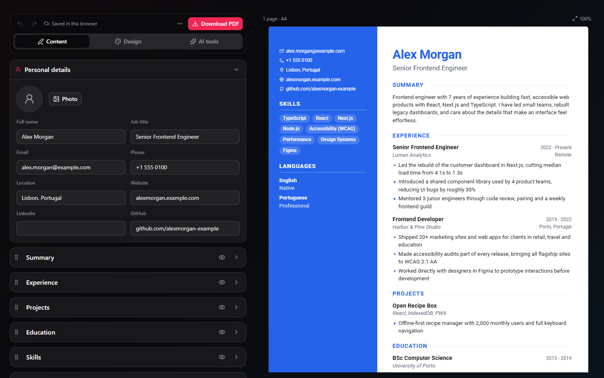

# CV Maker

A free, open source CV builder by **Rami Mizyed**. Write your CV with a live preview, pick one of four templates, tailor it to a job with AI, and download a real PDF. English, Turkish and Arabic (full RTL). No sign-up: your CV is saved in your own browser.

**Live:** https://cvmaker.ramimizyed.dev



## Features

**Editing**

- Live preview that is the exact document you download, with page-break guides
- Autosave to your browser, plus undo and redo (Ctrl+Z / Ctrl+Y)
- Drag to reorder sections, hide them, or rename their headings
- Sections: personal details, summary, experience, projects, education, skills, languages, certifications
- Photo upload (cropped and resized in the browser)
- JSON backup export and import (older CV Maker exports still import)

**Design**

- Templates: Classic, Modern (coloured sidebar), Minimal, and ATS-safe
- Accent colour, 15 bundled fonts (Latin and Arabic), text size, spacing, A4 or US Letter
- CV language setting (headings and text direction), independent of the site language

**PDF export**

The CV is printed from the browser, so the PDF has real, selectable text, working links, embedded fonts and correct Arabic shaping. Click **Download PDF** and choose **Save as PDF** in the print dialog.

**AI tools** (need an OpenAI key on the server)

- Tailor to a job: rewrites your summary and bullets and suggests skills. Each change is shown next to the original and only applied when you accept it.
- Import an existing CV from a PDF or pasted text (for example a LinkedIn profile)
- Cover letter writer, downloadable as a PDF with your CV's header

**CV check** (runs in the browser, free)

- Checklist for contact details, summary length, bullet count, numbers and results, strong verbs, length
- Keyword match against a pasted job description, with one-click "add to skills"

## Quickstart

```bash
git clone https://github.com/RamiMizyed/cv-maker.git
cd cv-maker
npm install
npm run dev
```

Open http://localhost:3000.

### Environment variables

Create `.env.local`:

```bash
# Required for the AI tools. Everything else works without it.
OPENAI_API_KEY=sk-...

# Optional
OPENAI_MODEL=gpt-4o-mini          # any chat model that supports JSON schema output
AI_RATE_LIMIT_PER_10_MIN=15       # AI requests per IP per 10 minutes
```

## How the AI routes are protected

`/api/ai/tailor`, `/api/ai/parse` and `/api/ai/cover-letter` share a guard in `src/lib/ai/server.ts`:

- only same-origin requests are accepted
- request bodies are size-capped (80 KB JSON, 4 MB PDF) and prompts are clipped
- per-IP rate limit, token caps on every call, and the photo is never sent to the model
- the job ad and imported text are treated as untrusted input in the prompts

The rate limit is kept in memory, so on serverless hosting each instance counts separately. For a hard limit, add Vercel WAF rate limiting or a KV store in front of `/api/ai`, and set a monthly budget in the OpenAI dashboard.

## Project structure

```
src/
  app/                     landing page, layout, API routes
  components/cv-maker/
    CVContext.tsx          state, undo/redo history, autosave
    document/              CVDocument (the one renderer), templates CSS, print root
    editor/                Content, Design and AI panels
    preview/               scaled live preview
  lib/
    cv/                    defaults, migration of old saves, analysis, helpers
    ai/                    server-side AI helpers
    translations.ts        EN / TR / AR strings
```

## Deployment

Optimised for Vercel. Import the repo, add `OPENAI_API_KEY` as an environment variable, and deploy.

## Contributing

Issues and pull requests are welcome. Please keep to the existing style (TypeScript, Tailwind, shadcn/ui). New UI text needs an entry for all three languages in `src/lib/translations.ts`; the `Translation` type makes the build fail if one is missing.

## License

MIT © Rami Mizyed
